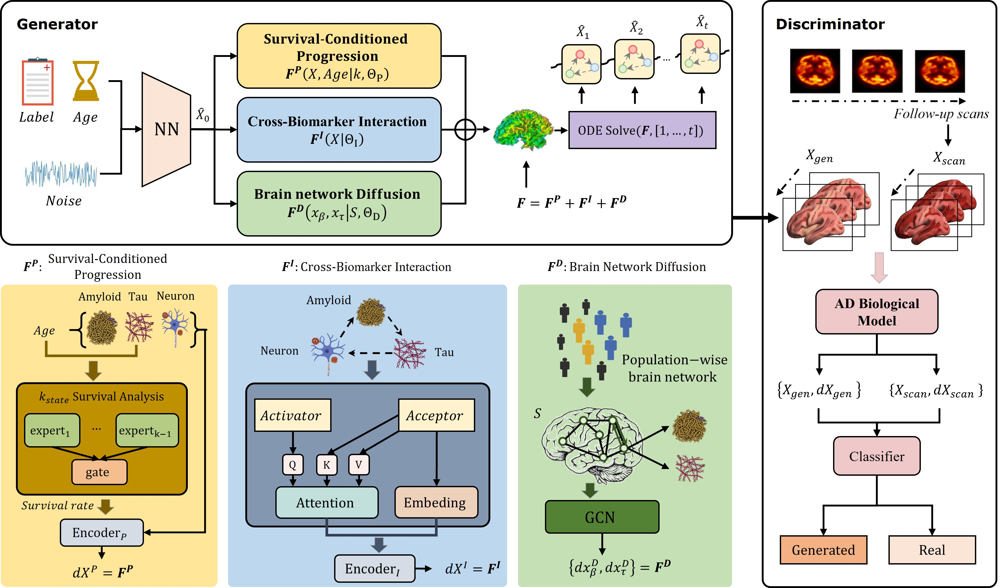

## Introduction

This repository contains the relevant code for **AlzheimerODE: A Knowledge-Guided Generative Model for Alzheimer's Disease Progression**.



AlzheimerODE is a knowledge-guided generative framework for Alzheimer's disease progression modeling. It represents disease evolution as a continuous-time dynamical process with structured pathological kinetics, cross-process interactions, brain-network diffusion, and survival-conditioned modulation.

## Requirements

Python version: 3.10

Create environment:

```bash
conda create -n alzheimerode python=3.10
conda activate alzheimerode
```

Install PyTorch:

```bash
pip install torch torchvision torchaudio
```

or via conda:

```bash
conda install pytorch torchvision torchaudio pytorch-cuda -c pytorch -c nvidia
```

Install other dependencies:

```bash
pip install -r requirements.txt
```

## Files

For the convenience of readers, the following is a brief description of the file
+ `run_experiment`:This code is the experiment entry file for AlzheimerODE

+ `alzheimer_ode`:This is the main file of AlzheimerODE, which contains the code implementation of the AlzheimerODE neural network

+ `atn_system`:This code is the structured pathological dynamics

+ `cox_survival`:This code implements the survival-conditioned progression component

+ `trainer`:This code implements the training and evaluation process

+ `metrics`:contains the evaluation metrics and useful functions

## Running

For training AlzheimerODE, use the following command:

```bash
python -m alzheimer_ode --stage all
```

For survival-module pretraining, use the following command:

```bash
python -m alzheimer_ode --stage pretrain
```

For evaluation, use the following command:

```bash
python -m alzheimer_ode --stage eval
```
